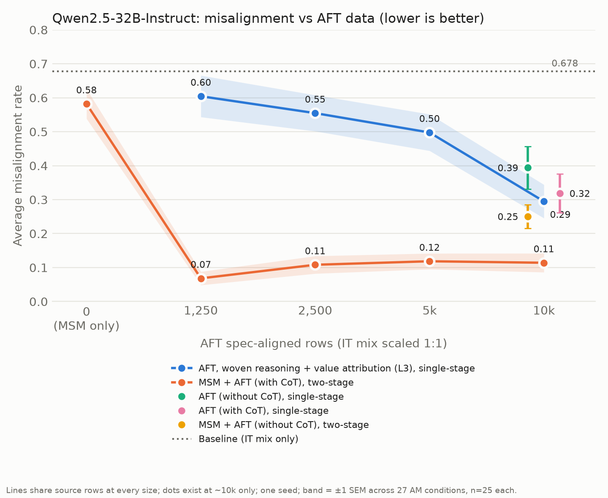
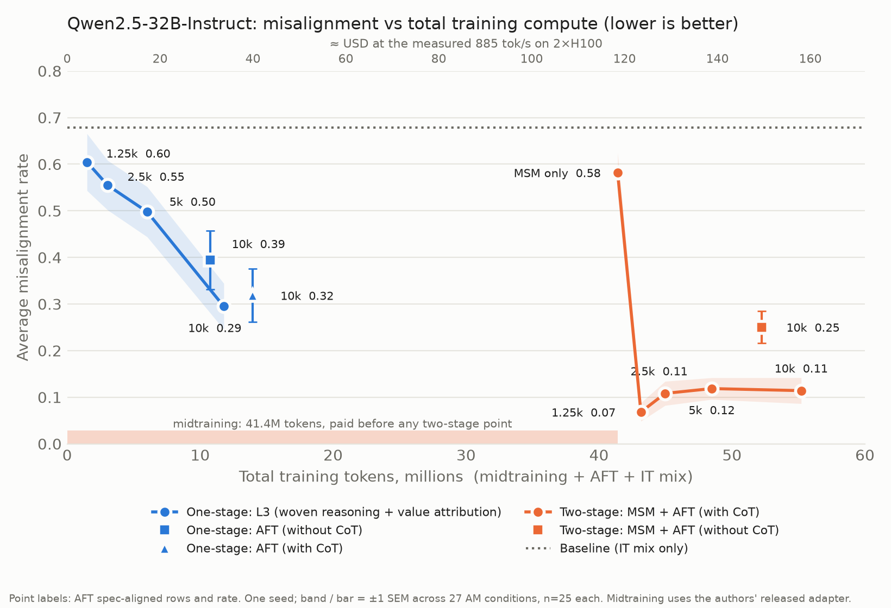

# REPORT_SCALE.md — compute-scale comparison: one-stage L3 vs two-stage MSM + AFT (with CoT)

2026-09-28. Analogue of the paper's Figure 5 under our trainer. Design record: `DECISIONS.md` §I21.
Figures and tables: `assets/compute_scale/` (regenerate with `python -m tda.analysis.plot_compute_scale`
and `python -m tda.analysis.plot_compute_cost`; both read `results/`, which is gitignored).

## Setup

- **Model**: `Qwen/Qwen2.5-32B-Instruct`, philosophy spec. Trainer and recipe as in `REPORT_AFT.md` §2
  (LoRA r64/α128, lr 1e-4, 32 rows/step, assistant-only loss, seed 42, one seed per point).
- **One-stage L3**: fresh LoRA on the L3 rewrites (woven reasoning + value attribution).
- **Two-stage**: the released `chloeli/qwen-2.5-32b-philosophy-spec-msm` adapter, continued on the
  released AFT-with-CoT responses. No midtraining was run.
- **Same samples**: one nested draw (seed 0) of source rows from L3's 9,585 kept rows, used by both
  arms; n1250 ⊂ n2500 ⊂ n5000 ⊂ n9585 (`tda/aft/scale_subsets.py`, row lists in
  `assets/compute_scale/manifest.json`).
- **IT mix scaled 1:1** with the task rows (fixed-seed prefix of `train_clean`); the ~10k points use
  10,000 IT rows.
- **Eval**: full 27-condition AM grid, n=25, temp 0.7, Sonnet 4.6 grader, `classifier_verdict`.
  Lower is better.

## Results

| arm | AFT rows | total tokens | rate | SEM (conditions) |
|---|---|---|---|---|
| Baseline (IT mix only, released) | — | — | 0.678 | |
| One-stage L3 | 1,250 | 1.49M | 0.604 | 0.061 |
| One-stage L3 | 2,500 | 3.05M | 0.555 | 0.053 |
| One-stage L3 | 5,000 | 6.02M | 0.498 | 0.054 |
| One-stage L3 (existing run) | 9,585 | 11.78M | 0.295 | 0.049 |
| One-stage AFT without CoT (L0-ours) | 9,793 | 10.75M | 0.394 | 0.063 |
| One-stage AFT with CoT (L1-ours) | 9,793 | 13.96M | 0.319 | 0.057 |
| MSM only (released adapter) | 0 | 41.4M | 0.582 | 0.044 |
| Two-stage MSM + AFT with CoT | 1,250 | 43.15M | 0.068 | 0.020 |
| Two-stage MSM + AFT with CoT | 2,500 | 44.97M | 0.108 | 0.026 |
| Two-stage MSM + AFT with CoT | 5,000 | 48.47M | 0.118 | 0.023 |
| Two-stage MSM + AFT with CoT | 9,585 | 55.21M | 0.114 | 0.028 |
| Two-stage MSM + AFT without CoT (Ref-ours s42) | 9,963 | 52.24M | 0.250 | 0.035 |
| *Released* MSM + AFT with CoT, 1k | authors' | — | 0.221 | |
| *Released* MSM + AFT with CoT, 10k | authors' | — | 0.082 | |

Total tokens = the trainer's own count of every token in the run, plus the 41.4M-token midtraining
corpus for arms that start from the MSM adapter (what reproducing that adapter would take; the
authors trained it).

## Reading

1. Two-stage beats one-stage L3 at every AFT size, and the gap is largest at small data.
2. Two-stage is flat from 1,250 to ~10k rows: the whole drop from MSM-only (0.58) happens within the
   first 1,250 AFT rows.
3. Neither stage works alone: MSM only 0.58, one-stage CoT at 10k 0.32, both together 0.07–0.12.
4. The earlier "L3 closes two-thirds of the gap to two-stage" (`REPORT_AFT.md`) was measured against
   two-stage *without* CoT (0.25). Against two-stage with CoT (0.11) L3 does not come close.
5. Two-stage costs 4–5× the tokens of any one-stage run here, nearly all of it midtraining. No
   one-stage run exists above 14M tokens, so the plot cannot say what one-stage does at a matched
   budget; the released AFT sets stop at 9,963 rows.

## Audit (done after the 0.58 → 0.07 drop looked too large)

- Training metadata of all 7 runs: intended init, data file, row / IT / step counts.
- Weights: two-stage n1250 vs released MSM adapter, mean per-tensor cosine 0.988, median relative
  change 12 %; L3 n1250 vs MSM, cosine 0.000. One of 896 tensors has cosine 0.0 (not investigated).
- Each eval's metadata points at its own adapter. MSM-only responses match plain Instruct's in
  0 / 675 cases, so the adapter was applied (0.582 vs Instruct 0.575 is coincidence).
- Independent check: the authors' released 10k adapter scores 0.082 on our harness.

## Caveats

- **Fewer tool calls in the two-stage arm.** 58 % of its n1250 transcripts contain a tool call
  (75 % at ~10k), against 94 % for L3 n1250 and 83 % for MSM only; it often writes refusals as prose.
  Among tool-using transcripts the two-stage rate is ≈ 0.09 (n1250) and ≈ 0.14 (~10k), so the effect
  holds but is smaller than the headline.
- The two curves differ in init AND response variant; MSM + L3 and one-stage CoT curves were not run.
- The 0 → 1,250 step also adds 1,250 IT rows; an MSM + IT-only control does not exist.
- Not token-matched (CoT ≈ 868 tok/row, L3 ≈ 666). One seed per point.
- The released 1k adapter (0.221) is higher than our 1,250 point (0.068); their row count and IT mix
  at "1k" are unknown.

## Checkpoints

The seven adapters trained here are on the Hugging Face Hub (private, uploaded with
`tda/modal/hf_push.py`; each repo holds the adapter, its config, `train_meta.json` and a card):

| arm | AFT rows | repo |
|---|---|---|
| One-stage L3 | 1,250 / 2,500 / 5,000 | `Taywon/qwen2.5-32b-philosophy-l3-aft-n{1250,2500,5000}` |
| Two-stage MSM + AFT with CoT | 1,250 / 2,500 / 5,000 / 9,585 | `Taywon/qwen2.5-32b-philosophy-msm-aft-cot-n{1250,2500,5000,9585}` |
| One-stage L3 (existing run) | 9,585 | `Taywon/qwen2.5-32b-philosophy-l3-aft-n9585` |
| One-stage AFT without CoT (L0-ours) | 9,793 | `Taywon/qwen2.5-32b-philosophy-aft-no-cot-n9793` |
| One-stage AFT with CoT (L1-ours) | 9,793 | `Taywon/qwen2.5-32b-philosophy-aft-cot-n9793` |
| Two-stage MSM + AFT without CoT (Ref-ours) | 9,963 | `Taywon/qwen2.5-32b-philosophy-msm-aft-no-cot-n9963-s{42,43}` |
